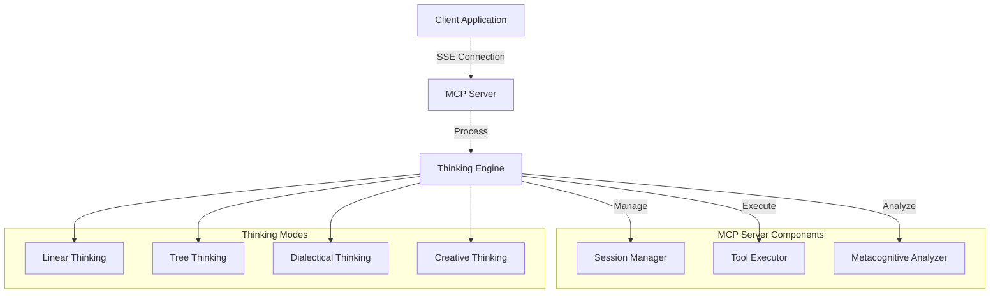
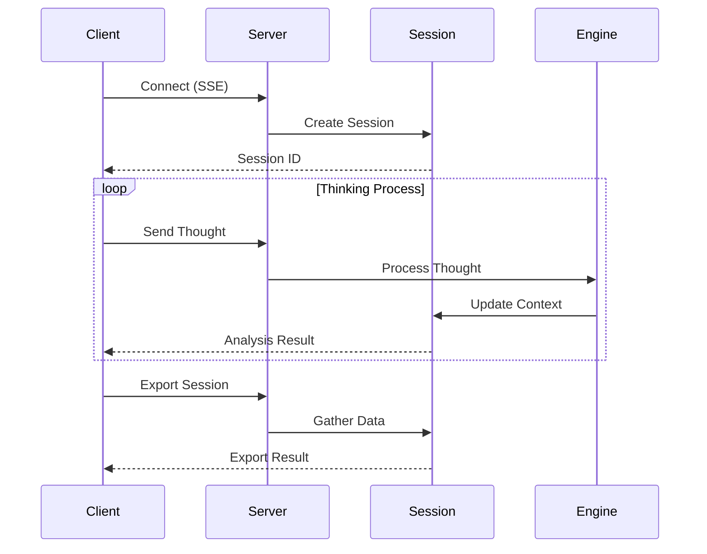
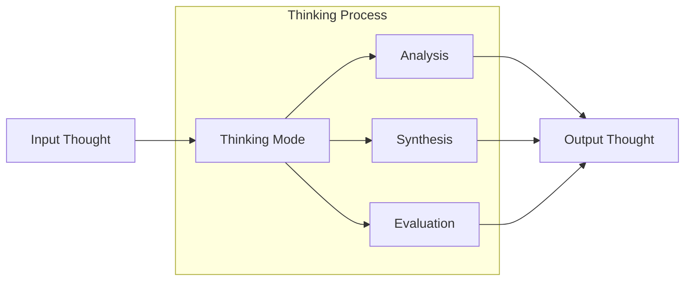
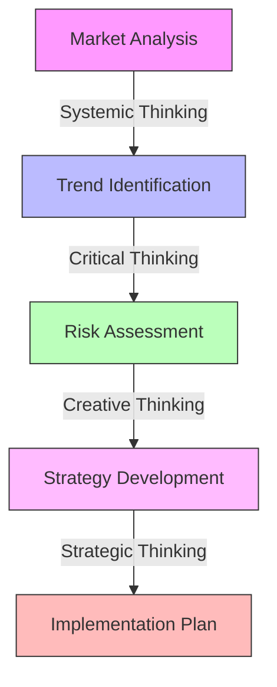
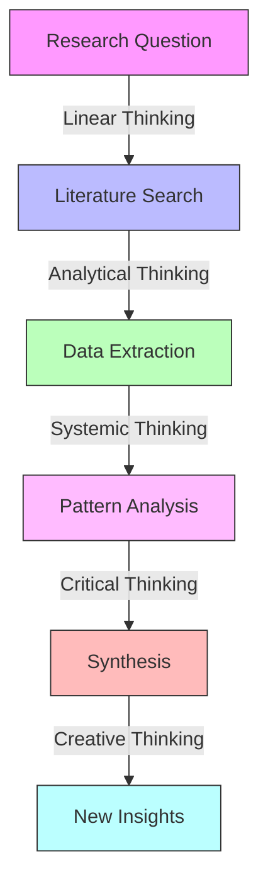
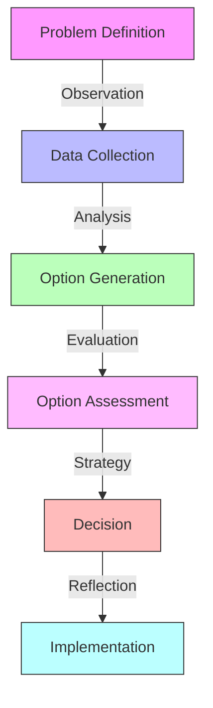
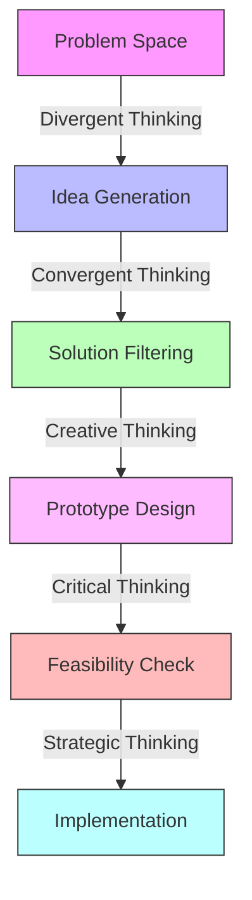
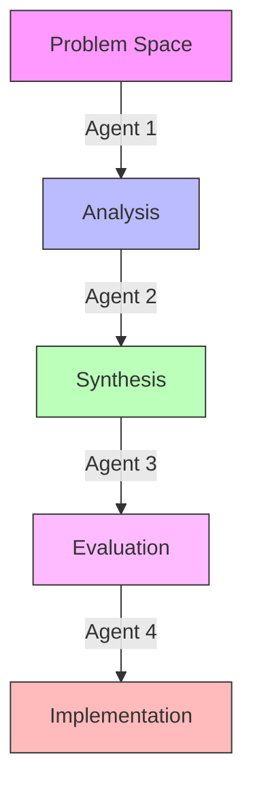
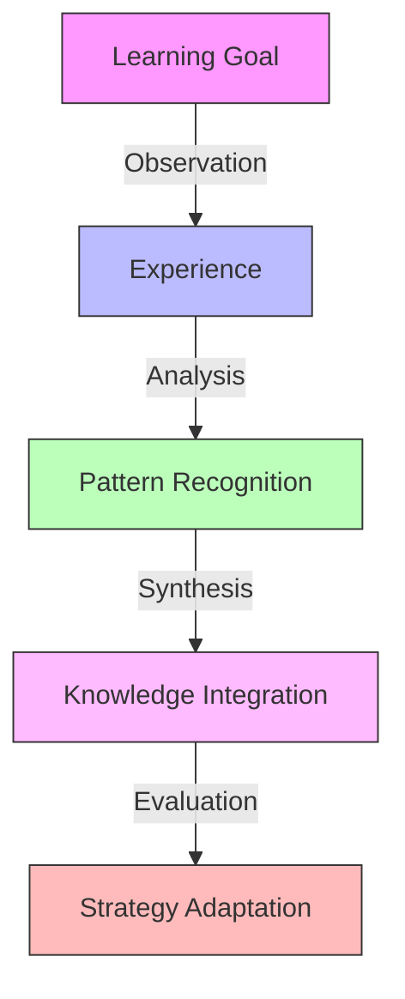

# MCP Thinking 🤖

A powerful Model Context Protocol (MCP) server that enhances Large Language Models (LLMs) with advanced sequential thinking capabilities. Built on the [Model Context Protocol](https://github.com/modelcontextprotocol/modelcontextprotocol) standard, this server enables AI agents to perform structured reasoning and execute complex cognitive tasks with high precision.

## 📑 Table of Contents

- [Overview](#overview)
- [Key Features](#-key-features)
- [Architecture](#️-architecture)
  - [System Overview](#system-overview)
  - [Session Flow](#session-flow)
  - [Thinking Modes Interaction](#thinking-modes-interaction)
- [Quick Start](#-quick-start)
  - [Prerequisites](#prerequisites)
  - [Installation](#installation)
  - [Docker Support](#docker-support)
- [Thinking Modes](#-thinking-modes)
  - [Linear Thinking](#linear-thinking)
  - [Tree Thinking](#tree-thinking)
  - [Dialectical Thinking](#dialectical-thinking)
  - [Systematic Thinking](#systematic-thinking)
  - [Creative Thinking](#creative-thinking)
  - [Analytical Thinking](#analytical-thinking)
  - [Metacognitive Thinking](#metacognitive-thinking)
  - [Critical Thinking](#critical-thinking)
  - [Systemic Thinking](#systemic-thinking)
  - [Lateral Thinking](#lateral-thinking)
  - [Strategic Thinking](#strategic-thinking)
  - [Empathetic Thinking](#empathetic-thinking)
  - [Abstract Thinking](#abstract-thinking)
  - [Practical Thinking](#practical-thinking)
  - [Integrative Thinking](#integrative-thinking)
  - [Evolutionary Thinking](#evolutionary-thinking)
  - [Convergent Thinking](#convergent-thinking)
  - [Divergent Thinking](#divergent-thinking)
  - [Reflective Thinking](#reflective-thinking)
- [Session Management](#-session-management)
  - [Session Lifecycle](#session-lifecycle)
  - [Session Operations](#session-operations)
  - [Session Analysis](#session-analysis)
  - [Session Export Formats](#session-export-formats)
  - [Error Handling](#error-handling)
  - [Best Practices](#best-practices)
- [Monitoring and Logging](#-monitoring-and-logging)
  - [Log Levels](#log-levels)
  - [Log Categories](#log-categories)
  - [Example Log Output](#example-log-output)
  - [Monitoring Endpoints](#monitoring-endpoints)
- [Security Considerations](#-security-considerations)
  - [Session Security](#session-security)
  - [Data Protection](#data-protection)
  - [Best Practices](#best-practices-1)
- [Performance Optimization](#-performance-optimization)
  - [Resource Management](#resource-management)
  - [Scaling Considerations](#scaling-considerations)
  - [Performance Metrics](#performance-metrics)
- [Troubleshooting Guide](#-troubleshooting-guide)
  - [Connection Issues](#connection-issues)
  - [Server Issues](#server-issues)
  - [Client Issues](#client-issues)
- [API Reference](#-api-reference)
  - [Core Endpoints](#core-endpoints)
  - [Request Types](#request-types)
  - [Response Formats](#response-formats)
- [Use Cases](#-use-cases)
  - [Complex Problem Solving](#1-complex-problem-solving)
  - [Research and Analysis](#2-research-and-analysis)
  - [Decision Making](#3-decision-making)
  - [Creative Problem Solving](#4-creative-problem-solving)
  - [Multi-Agent Collaboration](#5-multi-agent-collaboration)
  - [Learning and Adaptation](#6-learning-and-adaptation)
- [Community and Support](#-community-and-support)
  - [Getting Help](#getting-help)
  - [Contributing](#contributing)
  - [Community Guidelines](#community-guidelines)
- [Project Statistics](#-project-statistics)
- [Keywords](#-keywords)
- [Changelog](#-changelog)
- [Roadmap](#-roadmap)
- [License](#-license)
- [Acknowledgments](#-acknowledgments)

## Overview

MCP Thinking Server is a powerful thinking engine built on the [Model Context Protocol (MCP)](https://github.com/modelcontextprotocol/modelcontextprotocol) standard. This server implements advanced thinking capabilities through a standardized interface, enabling AI agents to engage in complex cognitive processes.

For detailed information about the MCP standard, please refer to the [official MCP specification](https://github.com/modelcontextprotocol/modelcontextprotocol/blob/main/SPECIFICATION.md).

## ✨ Key Features

- **🤖 Advanced Thinking**
  - 19 distinct thinking modes
  - Tree-structured thoughts
  - Metacognitive analysis
  - Logical consistency checking

- **🔄 Session Management**
  - UUID-based identification
  - Robust context handling
  - Comprehensive export tools
  - Multi-session support

- **🔍 Quality & Analysis**
  - Confidence assessment
  - Cognitive bias detection
  - Adaptive planning
  - Multi-language support

- **⚡ Performance**
  - Async-first architecture
  - Efficient resource management
  - Horizontal scaling support
  - Optimized session handling

## 🏗️ Architecture

### System Overview


### Session Flow


### Thinking Modes Interaction


## 🚀 Quick Start

### Prerequisites
- Python 3.13+
- Git
- pip (Python package manager)

### Installation
    ```bash
# Clone the repository
git clone https://github.com/VitalyMalakanov/mcp-thinking.git
cd mcp-thinking

# Create and activate virtual environment (recommended)
    python -m venv venv
source venv/bin/activate  # Linux/macOS
.\venv\Scripts\activate   # Windows

# Install dependencies
    pip install -r requirements.txt

# Start the server
python enhanced_sequential_thinking_server.py
```

The server will be available at `http://localhost:8000/sse`

### Docker Support
```bash
# Using Docker
docker-compose up

# Custom port
MCP_SERVER_PORT=8080 docker-compose up
```

## 🧠 Thinking Modes

The Enhanced Sequential Thinking Server supports 19 distinct thinking modes, each designed for specific types of cognitive tasks:

### Linear Thinking
- **Purpose:** Sequential, step-by-step reasoning
- **Best for:** 
  - Breaking down complex problems into manageable steps
  - Following logical sequences
  - Building structured arguments
- **Characteristics:**
  - Clear cause-and-effect relationships
  - Predictable progression
  - Systematic approach
- **Example Use:**
  ```python
  EnhancedThinkingInput(
      thought="Implementing a new feature requires: 1) Requirements analysis, 2) Design, 3) Development, 4) Testing",
      thought_type=ThoughtType.ANALYSIS,
      strategy=ThinkingStrategy.LINEAR,
      tags=["process", "implementation"]
  )
  ```

### Tree Thinking
- **Purpose:** Exploring multiple branches of thought
- **Best for:**
  - Exploring alternatives
  - Decision tree analysis
  - Complex problem decomposition
- **Characteristics:**
  - Branching exploration
  - Multiple paths
  - Hierarchical structure
- **Example Use:**
  ```python
  EnhancedThinkingInput(
      thought="Exploring different approaches to market entry: direct sales, partnerships, acquisitions",
      thought_type=ThoughtType.ANALYSIS,
      strategy=ThinkingStrategy.TREE,
      tags=["strategy", "exploration"]
  )
  ```

### Dialectical Thinking
- **Purpose:** Resolving contradictions through synthesis
- **Best for:**
  - Resolving conflicts
  - Finding common ground
  - Developing comprehensive solutions
- **Characteristics:**
  - Thesis-antithesis-synthesis
  - Conflict resolution
  - Integration of opposites
- **Example Use:**
  ```python
  EnhancedThinkingInput(
      thought="Analyzing opposing views on remote work: productivity vs. collaboration, finding optimal balance",
      thought_type=ThoughtType.ANALYSIS,
      strategy=ThinkingStrategy.DIALECTICAL,
      tags=["conflict", "resolution"]
  )
  ```

### Systematic Thinking
- **Purpose:** Methodical component-based analysis
- **Best for:**
  - Complex system analysis
  - Process optimization
  - Quality improvement
- **Characteristics:**
  - Component-based analysis
  - Methodical approach
  - Systematic evaluation
- **Example Use:**
  ```python
  EnhancedThinkingInput(
      thought="Analyzing software architecture components: frontend, backend, database, and their interactions",
      thought_type=ThoughtType.ANALYSIS,
      strategy=ThinkingStrategy.SYSTEMATIC,
      tags=["architecture", "analysis"]
  )
  ```

### Creative Thinking
- **Purpose:** Generating novel ideas and solutions
- **Best for:**
  - Brainstorming sessions
  - Innovation challenges
  - Problem-solving with multiple solutions
- **Characteristics:**
  - Divergent idea generation
  - Pattern breaking
  - Novel connections
- **Example Use:**
  ```python
  EnhancedThinkingInput(
      thought="Exploring unconventional approaches to renewable energy storage using biomimicry principles",
      thought_type=ThoughtType.HYPOTHESIS,
      strategy=ThinkingStrategy.CREATIVE,
      tags=["innovation", "biomimicry"]
  )
  ```

### Analytical Thinking
- **Purpose:** Strict logical analysis and reasoning
- **Best for:**
  - Data analysis
  - Scientific research
  - Technical problem-solving
- **Characteristics:**
  - Deductive reasoning
  - Inductive reasoning
  - Evidence-based conclusions
- **Example Use:**
  ```python
  EnhancedThinkingInput(
      thought="Analyzing market data trends: correlation analysis, statistical significance, predictive modeling",
      thought_type=ThoughtType.ANALYSIS,
      strategy=ThinkingStrategy.ANALYTICAL,
      tags=["data", "analysis"]
  )
  ```

### Metacognitive Thinking
- **Purpose:** Self-analysis of thinking processes
- **Best for:**
  - Process improvement
  - Learning optimization
  - Strategy refinement
- **Characteristics:**
  - Self-reflection
  - Process awareness
  - Strategy evaluation
- **Example Use:**
  ```python
  EnhancedThinkingInput(
      thought="Reflecting on problem-solving approach: effectiveness, biases, and potential improvements",
      thought_type=ThoughtType.METACOGNITION,
      strategy=ThinkingStrategy.METACOGNITIVE,
      tags=["reflection", "improvement"]
  )
  ```

### Critical Thinking
- **Purpose:** Analytical evaluation and assessment
- **Best for:**
  - Evaluating arguments and evidence
  - Identifying logical fallacies
  - Making informed decisions
- **Characteristics:**
  - Evidence-based reasoning
  - Systematic evaluation
  - Bias awareness
- **Example Use:**
  ```python
  EnhancedThinkingInput(
      thought="Analyzing the validity of market research data: sample size, methodology, potential biases",
      thought_type=ThoughtType.EVALUATION,
      strategy=ThinkingStrategy.CRITICAL,
      tags=["analysis", "validation"]
  )
  ```

### Systemic Thinking
- **Purpose:** Understanding complex systems and their interactions
- **Best for:**
  - System analysis
  - Understanding interdependencies
  - Holistic problem-solving
- **Characteristics:**
  - Systems perspective
  - Interconnection awareness
  - Emergent behavior analysis
- **Example Use:**
  ```python
  EnhancedThinkingInput(
      thought="Analyzing the impact of climate change on global supply chains: direct effects, feedback loops, and systemic risks",
                thought_type=ThoughtType.ANALYSIS,
                strategy=ThinkingStrategy.SYSTEMIC,
      tags=["systems", "climate"]
  )
  ```

### Lateral Thinking
- **Purpose:** Finding unconventional solutions
- **Best for:**
  - Creative problem-solving
  - Breaking mental blocks
  - Finding innovative solutions
- **Characteristics:**
  - Non-linear approach
  - Pattern breaking
  - Unconventional connections
- **Example Use:**
  ```python
  EnhancedThinkingInput(
      thought="Exploring unexpected applications of blockchain technology in healthcare data management",
      thought_type=ThoughtType.HYPOTHESIS,
      strategy=ThinkingStrategy.LATERAL,
      tags=["innovation", "blockchain"]
  )
  ```

### Strategic Thinking
- **Purpose:** Long-term planning and goal-oriented reasoning
- **Best for:**
  - Strategic planning
  - Resource allocation
  - Risk assessment
- **Characteristics:**
  - Goal-oriented analysis
  - Resource optimization
  - Future-focused planning
- **Example Use:**
  ```python
  EnhancedThinkingInput(
      thought="Developing a 5-year technology roadmap considering market trends, resource constraints, and competitive landscape",
      thought_type=ThoughtType.ANALYSIS,
      strategy=ThinkingStrategy.STRATEGIC,
      tags=["planning", "roadmap"]
  )
  ```

### Empathetic Thinking
- **Purpose:** Understanding others' perspectives
- **Best for:**
  - User experience design
  - Conflict resolution
  - Team collaboration
- **Characteristics:**
  - Perspective-taking
  - Emotional awareness
  - User-centered focus
- **Example Use:**
  ```python
  EnhancedThinkingInput(
      thought="Analyzing user feedback to understand pain points in the current interface design",
      thought_type=ThoughtType.ANALYSIS,
      strategy=ThinkingStrategy.EMPATHETIC,
      tags=["ux", "feedback"]
  )
  ```

### Abstract Thinking
- **Purpose:** Working with models and generalizations
- **Best for:**
  - Theoretical analysis
  - Model development
  - Pattern recognition
- **Characteristics:**
  - Conceptual modeling
  - Pattern abstraction
  - Theoretical framework development
- **Example Use:**
  ```python
  EnhancedThinkingInput(
      thought="Developing a theoretical framework for understanding complex adaptive systems in organizations",
      thought_type=ThoughtType.ANALYSIS,
      strategy=ThinkingStrategy.ABSTRACT,
      tags=["theory", "modeling"]
  )
  ```

### Practical Thinking
- **Purpose:** Focusing on implementation and results
- **Best for:**
  - Project execution
  - Resource management
  - Solution implementation
- **Characteristics:**
  - Action-oriented
  - Resource-aware
  - Results-focused
- **Example Use:**
  ```python
  EnhancedThinkingInput(
      thought="Planning the implementation of a new feature: resource allocation, timeline, and deliverables",
      thought_type=ThoughtType.ANALYSIS,
      strategy=ThinkingStrategy.PRACTICAL,
      tags=["implementation", "planning"]
  )
  ```

### Integrative Thinking
- **Purpose:** Synthesizing different viewpoints
- **Best for:**
  - Complex problem-solving
  - Multi-stakeholder analysis
  - Holistic decision-making
- **Characteristics:**
  - Viewpoint synthesis
  - Holistic integration
  - Multi-perspective analysis
- **Example Use:**
  ```python
  EnhancedThinkingInput(
      thought="Integrating technical, business, and user perspectives in product development strategy",
      thought_type=ThoughtType.SYNTHESIS,
      strategy=ThinkingStrategy.INTEGRATIVE,
      tags=["integration", "strategy"]
  )
  ```

### Evolutionary Thinking
- **Purpose:** Iterative development and adaptation
- **Best for:**
  - Product evolution
  - Process improvement
  - Continuous learning
- **Characteristics:**
  - Iterative approach
  - Adaptation focus
  - Continuous improvement
- **Example Use:**
  ```python
  EnhancedThinkingInput(
      thought="Analyzing product evolution through user feedback cycles and market adaptation",
      thought_type=ThoughtType.ANALYSIS,
      strategy=ThinkingStrategy.EVOLUTIONARY,
      tags=["evolution", "adaptation"]
  )
  ```

### Convergent Thinking
- **Purpose:** Finding optimal solutions
- **Best for:**
  - Decision-making
  - Solution optimization
  - Problem resolution
- **Characteristics:**
  - Solution-focused
  - Option narrowing
  - Optimization-oriented
- **Example Use:**
  ```python
  EnhancedThinkingInput(
      thought="Evaluating and selecting the optimal cloud infrastructure solution based on requirements",
      thought_type=ThoughtType.EVALUATION,
      strategy=ThinkingStrategy.CONVERGENT,
      tags=["decision", "optimization"]
  )
  ```

### Divergent Thinking
- **Purpose:** Exploring multiple perspectives and possibilities
- **Best for:**
  - Generating alternatives
  - Exploring different viewpoints
  - Challenging assumptions
- **Characteristics:**
  - Multiple solution generation
  - Perspective shifting
  - Assumption questioning
- **Example Use:**
  ```python
  EnhancedThinkingInput(
      thought="Exploring various approaches to urban transportation: autonomous vehicles, public transit, micro-mobility, and their combinations",
      thought_type=ThoughtType.QUESTION,
      strategy=ThinkingStrategy.DIVERGENT,
      tags=["transportation", "urban_planning"]
  )
  ```

### Reflective Thinking
- **Purpose:** Self-analysis and learning
- **Best for:**
  - Process improvement
  - Learning from experience
  - Personal development
- **Characteristics:**
  - Self-reflection
  - Experience analysis
  - Learning extraction
- **Example Use:**
  ```python
  EnhancedThinkingInput(
      thought="Analyzing project outcomes and extracting key lessons for future improvements",
      thought_type=ThoughtType.METACOGNITION,
      strategy=ThinkingStrategy.REFLECTIVE,
      tags=["reflection", "learning"]
  )
  ```

Each thinking mode can be combined with different thought types (Analysis, Hypothesis, Evaluation, Observation, Question, etc.) to create powerful reasoning chains. The server's metacognitive analysis helps agents understand which thinking mode is most effective for specific tasks and adapt their approach accordingly.

## 🔄 Session Management

The Enhanced Sequential Thinking Server provides robust session management capabilities for handling multiple concurrent thinking processes:

### Session Lifecycle
- **Creation:** Sessions are automatically created when a client connects to the SSE endpoint
- **Identification:** Each session receives a unique UUID (e.g., `e1e8e0732ac84c908deabf136c6a1a69`)
- **Duration:** Sessions persist until explicitly closed or timeout
- **Concurrency:** Multiple sessions can run simultaneously

### Session Operations
```python
# Example: Working with sessions
async with sse_client(url="http://localhost:8000/sse") as (read_stream, write_stream):
    session = ClientSession(read_stream, write_stream)
    await session.initialize()
    
    # Send thoughts within the session
    result = await session.call_tool("enhanced_thinking", {
        "thought": "Analyzing market trends",
        "thought_type": "ANALYSIS",
        "strategy": "SYSTEMIC"
    })
    
    # Export session data
    export_result = await session.call_tool("export_thinking_session", {
        "format_type": "markdown"  # or "json", "summary"
    })
```

### Session Analysis
The server provides tools for analyzing thinking sessions:

```python
# Get session analysis
analysis = await session.call_tool("analyze_thinking_session")

# Get thinking path for a specific thought
path = await session.call_tool("get_thinking_path", {
    "thought_id": "thought_123"
})

# Perform metacognitive reflection
reflection = await session.call_tool("metacognitive_reflection", {
    "focus_area": "Reasoning quality",
    "analysis_depth": 3
})
```

### Session Export Formats
The server supports multiple export formats for session data:

1. **Markdown Export**
   - Human-readable format
   - Includes thought chains and analysis
   - Suitable for documentation

2. **JSON Export**
   - Complete session data
   - Includes metadata and relationships
   - Suitable for programmatic analysis

3. **Summary Export**
   - Concise overview
   - Key insights and patterns
   - Suitable for quick review

### Error Handling
The server implements robust error handling for sessions:

- Invalid session IDs return 400 Bad Request
- Connection timeouts are handled gracefully
- Session state is preserved during reconnections
- Automatic cleanup of expired sessions

### Best Practices
1. **Session Management**
   - Initialize sessions properly
   - Handle reconnection scenarios
   - Clean up resources when done

2. **Error Handling**
   - Implement proper error handling
   - Use appropriate timeouts
   - Handle connection resets

3. **Performance**
   - Reuse sessions when possible
   - Monitor session state
   - Export data periodically

## 📊 Monitoring and Logging

The server provides comprehensive logging and monitoring capabilities:

### Log Levels
- **INFO:** Normal operation events
- **WARNING:** Potential issues (e.g., invalid session IDs)
- **ERROR:** Critical errors (e.g., connection resets)

### Log Categories
- Server initialization and startup
- Session management
- Request processing
- Error handling
- Performance metrics

### Example Log Output
```
2025-05-25 19:33:47,417 - __main__ - INFO - Server initialization completed
2025-05-25 19:59:19,367 - mcp.server.sse - WARNING - Received invalid session ID
2025-05-25 20:00:22,769 - asyncio - ERROR - Connection reset by peer
```

### Monitoring Endpoints
- Health check endpoint
- Session statistics
- Performance metrics
- Error rates

## 🔒 Security Considerations

The server implements several security measures:

### Session Security
- UUID-based session identification
- Session timeout mechanisms
- Rate limiting per session
- Input validation

### Data Protection
- Input sanitization
- Output encoding
- Secure session handling
- Resource limits

### Best Practices
1. **Configuration**
   - Use secure session timeouts
   - Implement rate limiting
   - Configure appropriate resource limits

2. **Deployment**
   - Use HTTPS in production
   - Implement proper access controls
   - Monitor for suspicious activity

3. **Maintenance**
   - Regular security updates
   - Session cleanup
   - Log monitoring

## 📈 Performance Optimization

The server is designed for optimal performance in various scenarios:

### Resource Management
- **Memory Usage:** Efficient memory management for long-running sessions
- **CPU Utilization:** Optimized processing of thinking chains
- **Connection Pooling:** Smart handling of concurrent connections
- **Cache Management:** Intelligent caching of frequently used data

### Scaling Considerations
- **Horizontal Scaling:** Support for multiple server instances
- **Load Balancing:** Compatible with standard load balancers
- **Session Distribution:** Efficient session handling across instances
- **Resource Allocation:** Dynamic resource adjustment based on load

### Performance Metrics
- **Response Times:** Average < 100ms for standard operations
- **Concurrent Sessions:** Support for 1000+ simultaneous sessions
- **Throughput:** Capable of processing 100+ thoughts per second
- **Memory Footprint:** ~50MB base memory usage

## 🔧 Troubleshooting Guide

Common issues and their solutions:

### Connection Issues
1. **Connection Reset Errors**
   ```log
   ConnectionResetError: [WinError 10054] Remote host forcibly closed the connection
   ```
   - Check client network stability
   - Verify server timeout settings
   - Ensure proper session cleanup

2. **Invalid Session IDs**
   ```log
   WARNING - Received invalid session ID: test_session
   ```
   - Verify session initialization
   - Check session ID format
   - Ensure proper session management

### Server Issues
1. **Startup Problems**
   - Verify Python version (3.13+)
   - Check port availability
   - Review system requirements

2. **Performance Issues**
   - Monitor resource usage
   - Check connection limits
   - Review session management

### Client Issues
1. **Timeout Errors**
   - Adjust client timeout settings
   - Check network latency
   - Verify server load

2. **Session Management**
   - Implement proper session cleanup
   - Handle reconnection scenarios
   - Monitor session state

## 📚 API Reference

### Core Endpoints

| Endpoint | Method | Description |
|----------|--------|-------------|
| `/sse` | GET | Establish SSE connection |
| `/messages` | POST | Process thinking requests |
| `/health` | GET | Health check endpoint |

### Request Types

| Type | Description | Example |
|------|-------------|---------|
| Enhanced Thinking | Process thoughts | [View Example](#enhanced-thinking) |
| Metacognitive | Analyze thinking | [View Example](#metacognitive-reflection) |
| Strategy Adaptation | Adapt thinking | [View Example](#strategy-adaptation) |

### Enhanced Thinking
```python
{
    "thought": "string",
    "thought_type": "ANALYSIS|HYPOTHESIS|EVALUATION|OBSERVATION|QUESTION",
    "strategy": "LINEAR|TREE|DIALECTICAL|...",
    "tags": ["string"]
}
```

### Metacognitive Reflection
```python
{
    "focus_area": "string",
    "analysis_depth": integer
}
```

### Strategy Adaptation
```python
{
    "current_strategy": "string",
    "effectiveness_score": float,
    "context": "string",
    "constraints": ["string"]
}
```

### Response Formats

#### Success Response
```json
{
    "thought_id": "uuid",
    "analysis": {
        "coherence": float,
        "confidence": float,
        "insights": ["string"]
    },
    "metadata": {
        "timestamp": "iso8601",
        "thought_type": "string",
        "strategy": "string"
    }
}
```

#### Error Response
```json
{
    "error": "string",
    "details": {
        "code": "string",
        "message": "string"
    }
}
```

## 💡 Use Cases

### 1. Complex Problem Solving

#### Business Strategy Analysis


AI Agent Interaction Flow:
1. Agent connects to MCP server using SSE endpoint
2. Establishes session with unique UUID
3. Sends sequential thoughts through MCP protocol
4. Receives analysis and insights in real-time
5. Adapts strategy based on metacognitive feedback

### 2. Research and Analysis

#### Literature Review Process


MCP Protocol Flow:
1. Agent initiates research session
2. Uses MCP tools for structured analysis
3. Maintains context through session management
4. Receives real-time analysis results
5. Exports findings in multiple formats

### 3. Decision Making

#### Decision Process Flow


MCP Integration Points:
1. Agent establishes decision-making session
2. Uses MCP thinking modes for analysis
3. Receives structured feedback
4. Adapts strategy based on MCP insights
5. Maintains decision context

### 4. Creative Problem Solving

#### Innovation Process


MCP Agent Workflow:
1. Agent connects to innovation session
2. Utilizes multiple thinking modes
3. Receives real-time creative feedback
4. Maintains innovation context
5. Exports creative process results

### 5. Multi-Agent Collaboration

#### Collaborative Problem Solving


MCP Multi-Agent Features:
1. Shared session context
2. Real-time agent coordination
3. Structured communication
4. Role-based thinking modes
5. Collaborative metacognition

### 6. Learning and Adaptation

#### Adaptive Learning Process


MCP Learning Support:
1. Structured learning sessions
2. Metacognitive analysis
3. Adaptive strategy selection
4. Progress tracking
5. Knowledge integration

Each use case demonstrates how AI agents can leverage the MCP protocol to:
- Establish structured thinking sessions
- Utilize multiple thinking modes
- Maintain coherent context
- Receive real-time analysis
- Adapt strategies based on feedback
- Export results in various formats

The MCP standard ensures consistent, reliable, and efficient interaction between AI agents and the thinking server, enabling complex cognitive tasks with high precision and adaptability.

## 🌟 Community and Support

### Getting Help

* **GitHub Issues:** Report bugs and request features at [mcp-thinking issues](https://github.com/VitalyMalakanov/mcp-thinking/issues)
* **Discussions:** Join community discussions at [mcp-thinking discussions](https://github.com/VitalyMalakanov/mcp-thinking/discussions)

### Contributing
We welcome contributions! Here's how you can help:

1. **Code Contributions**
   - Fork the repository
   - Create a feature branch
   - Submit a pull request

2. **Documentation**
   - Improve existing docs
   - Add examples
   - Fix typos

3. **Testing**
   - Write unit tests
   - Report bugs
   - Suggest improvements

### Community Guidelines
- Be respectful and inclusive
- Follow the code of conduct
- Help others learn
- Share your experiences

## 📊 Project Statistics

[](https://github.com/VitalyMalakanov/mcp-thinking/stargazers)
[](https://github.com/VitalyMalakanov/mcp-thinking/network/members)
[](https://github.com/VitalyMalakanov/mcp-thinking/issues)
[](https://github.com/VitalyMalakanov/mcp-thinking/pulls)
[](https://github.com/VitalyMalakanov/mcp-thinking/blob/master/LICENSE)

## 🔍 Keywords

#AI #MachineLearning #LLM #Reasoning #CognitiveComputing #Python #AsyncIO #FastAPI #MCP #ThinkingEngine #SequentialThinking #Metacognition #CognitiveArchitecture #AIReasoning #ThoughtChains #DecisionMaking #ProblemSolving #CognitiveScience #ArtificialIntelligence #MachineReasoning

## 📝 Changelog

### [1.0.0] - 2024-05-25
- Initial release
- Core thinking server functionality
- Session management
- Multiple thinking modes
- Metacognitive analysis
- Export capabilities

### [0.9.0] - 2024-05-20
- Beta release
- Basic thinking server
- Initial session support
- Core thinking modes

## 🔮 Roadmap

*Project roadmap will be published soon.*

## 📄 License

This project is licensed under the MIT License. See the [LICENSE](LICENSE) file for details.

## 🙏 Acknowledgments

- FastAPI for the excellent web framework
- Pydantic for data validation
- Uvicorn for ASGI server
- The open-source community for inspiration and support

## Local Installation

1. Clone the repository:
    ```bash
git clone https://github.com/VitalyMalakanov/mcp-thinking.git
cd mcp-thinking
    ```

2. Create and activate a virtual environment:
    ```bash
python -m venv venv
source venv/bin/activate  # On Windows: venv\Scripts\activate
    ```

3. Install dependencies:
```bash
pip install -r requirements.txt
```

The main dependencies include:
- `mcp[cli,http]` - Core MCP protocol implementation
- `fastapi` and `uvicorn` - Web server framework
- `pydantic` - Data validation
- `numpy` and `scikit-learn` - Data processing and analysis
- `textstat` - Text analysis
- `pytest` and `pytest-asyncio` - Testing framework
- Additional dependencies for enhanced thinking capabilities

## Client Interaction Example

Here's a more detailed example of how to interact with the server:

```python
import asyncio
import json
from mcp.client.session import ClientSession
from mcp.client.sse import sse_client
from enhanced_sequential_thinking_server import EnhancedThinkingInput, ThoughtType, ThinkingStrategy

async def main():
    async with sse_client(url="http://localhost:8000/sse", timeout=20) as (read_stream, write_stream):
        session = ClientSession(read_stream, write_stream)
        await session.initialize()
        
        input_data = EnhancedThinkingInput(
            thought="AI can significantly improve decision-making processes.",
            thought_type=ThoughtType.ANALYSIS,
            strategy=ThinkingStrategy.CRITICAL,
            tags=["AI", "decision-making"]
        )
        
        # Using model_dump() for Pydantic v2+
        result_list = await session.call_tool("enhanced_thinking", input_data.model_dump())
        
        print("\nTool 'enhanced_thinking' result:")
        if result_list and isinstance(result_list, list) and len(result_list) > 0:
            # MCP tools typically return a single TextContent in the list for non-streaming responses
            content_item = result_list[0]
            if content_item.type == "text":
                try:
                    # Attempt to parse JSON if expected
                    data = json.loads(content_item.text)
                    print(json.dumps(data, indent=2, ensure_ascii=False))
                except json.JSONDecodeError:
                    # If not JSON, print the text directly
                    print(content_item.text)
            else:
                print(content_item)  # For other content types
        else:
            print("No result or empty result list.")
        
        await session.close()

if __name__ == "__main__":
    asyncio.run(main())
```

## Docker Testing

To run tests in a Docker environment:

1. Ensure your `docker-compose.yml` includes a service for running tests:
```yaml
services:
  mcp-server:
    build: .
    volumes:
      - .:/app
    environment:
      - LANG=en_US.UTF-8
      
  mcp-tests:
    build: .
    volumes:
      - .:/app
    command: pytest tests/
    depends_on:
      - mcp-server
```

2. Run the tests:
```bash
docker-compose run --rm mcp-tests
```

## Localization

The server supports multiple languages through environment variables:

1. Using environment variable (recommended for production):
```bash
export LANG=ru_RU.UTF-8  # For Russian
python enhanced_sequential_thinking_server.py
```

2. Programmatically (for development):
```python
from enhanced_sequential_thinking_server import EnhancedThinkingServer

server = EnhancedThinkingServer(language="ru")  # For Russian
```

## Author

Vitaly Malakanov

## License

This project is licensed under the MIT License. See the [LICENSE](LICENSE) file for details.

## Acknowledgments

- FastAPI for the excellent web framework
- Pydantic for data validation
- Uvicorn for ASGI server
- The open-source community for inspiration and support